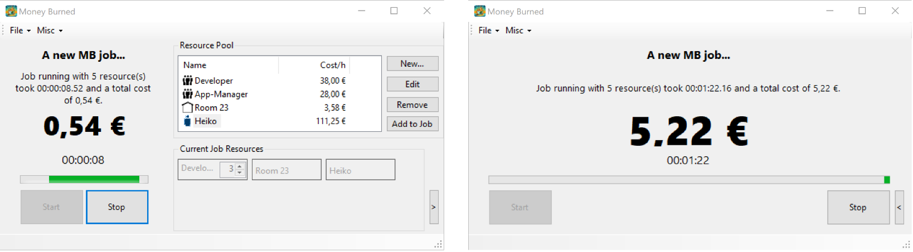

# Money Burned: mb-dotnet-winapp

This repository is one of several reference implementations of the application "Money Burned" to illustrate the use of a particular development technology/platform. To learn more about it, check out the [organization profile](https://github.com/Money-Burned).  

The [.NET](https://dotnet.microsoft.com/en-us/learn/dotnet/what-is-dotnet) (pronounced "Dotnet") based application shows how to implement the [requirements](https://github.com/Money-Burned/.github/blob/main/doc/requirements.md) with a simple graphical user interface for current Microsoft Windows operating systems using the native .NET [frontend framework WinForms](https://en.wikipedia.org/wiki/Windows_Forms).  

  
---

**A small note:** More information about the mysterious branch line ending in `-min` can be found in the [development approach documentation at section _Requirements_](./doc/dev-approach.md#requirements).  

## Quick facts

- Application type: **Desktop-App**
- Available for: **Windows**
- Framework/Technology used: **[.NET 9.0](https://dotnet.microsoft.com/en-us/download/dotnet/9.0)**
- Programming Language used: **C#**
- User interaction: **GUI** 

> Degree of difficulty: **moderate ✌**

## Getting started

### Prerequisites

- [Download](https://git-scm.com/downloads) and install a current version of Git
- [Download](https://dotnet.microsoft.com/en-us/download) and Install .NET SDK (at least Version 9.0)
- Create a development folder into which you clone the required repositories
    - Clone the dependency project [repository "mb-dotnet-lib"](https://github.com/Money-Burned/mb-dotnet-lib)
    - Clone this [repository](https://github.com/Money-Burned/mb-dotnet-winapp)

If you are working under Windows, you can perform all of the above steps with the following [PowerShell](https://learn.microsoft.com/de-de/powershell/scripting/what-is-a-command-shell?view=powershell-7.5) commands to get started:  

```powershell
winget install Git.Git -e
winget install Microsoft.DotNet.SDK.9 -e
md ~\Money-Burned
cd ~\Money-Burned
git clone https://github.com/Money-Burned/mb-dotnet-lib.git
git clone https://github.com/Money-Burned/mb-dotnet-winapp.git
ls
```

_**HINT:** If you are confronted with an error message stating that `git` is not a recognized command, Git may never have been installed on your computer. You will then need to restart your terminal/console/shell and run the last three lines again._  

### How to run the program

Once you have met all the requirements, you are good to go:  

```powershell
cd ~\Money-Burned\mb-dotnet-winapp\src
dotnet run
```

### How to develop

For information about the development process of this application please refer to the [development approach documentation](./doc/dev-approach.md). Here you can find more details about the steps taken to develop the application up to this point.  

## Usage

When the application starts, there are no resources defined. Please add some by using the _"Add" button_ at the right side. As soon as there are resources added, you can press the _"Start" button_ at the lower left side.  

## More things to know

The application menu (_File_ and _Misc_) is not yet fully implemented - so don't be confused if the buttons don't work as expected. Later you should be able to open/save jobs and/or resource sets, make settings and display the "About" dialog box.  
