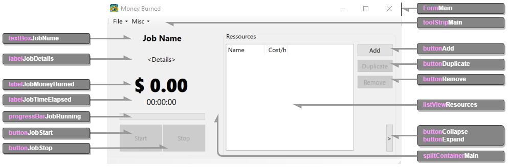

# Development approach of mb-dotnet-winapp

Sorry folks, I'm not done yet - please stay tuned to catch up with the whole journey... `¯\_(ツ)_/¯`  

But: some parts are filled in already:  

1. [Requirements implemented](#requirements)
2. [Tutorial](#tutorial)
    - [Creating a new WinForms Dotnet application](#creating-a-new-winforms-dotnet-application)
    - [Preparing the project](#preparation-of-the-created-winforms-project-for-further-development)
    - [Creating the user interface](#creating-the-user-interface)
    - [Implementing the logic](#creating-the-logic-and-wiring-with-the-user-interface)

## Framework or development platform used

- Origin and some background on the chosen framework/platform
- Links to further literature (official documentation / Wikipedia)
- What knowledge one should already have when choosing this framework/platform?
- Cost and license considerations in the context of the framework/platform

### Method of approach

- Why that framework?
    - Common benefits and/or disadvantages
    - Limitations ("only works on before high noon and below 20 degrees")
- Are there any dependencies on the operating system and if not, what do you have to consider if you want to run it on different operating systems?
- Are there any dependencies on other software in your code, e.g. libraries that you use?
- How much time should a developer plan to use/reimplement your approach?

### Development environment

- How do you set up a modern development environment for optimal development processes?
- Tools of choice

## Planning and software design

### Requirements

- What did you do to map the requirements to specific tasks to implement?
- Did you use user stories or requirements or both?
- To what extent have you broken it down?
- What requirements did you end up implementing? 

**A quick word on my idea to differentiate between the completeness of the features:** The project maintains two separately managed branch lines (two each for the main and develop lines). Requirements define a [minimum](https://github.com/Money-Burned/.github/blob/main/doc/requirements.md#minimum-requirements) and an [optional set of requirements](https://github.com/Money-Burned/.github/blob/main/doc/requirements.md#optional-requirements), which this distinction is intended to take into account.  
You can recognize it by whether the suffix `-min` is present or absent from the two main branch lines (_main_ and _develop_).  

| ReqID | Implemented? | Remarks (why not; challenges; how?) |
| :--- | :---: | :--- | 
| MF 01.1 | Yes | Separate dialog at runtime |
| MF 01.2 | Yes | Part of resource creation |
| MF 02.1 | Yes | Button below stopwatch |
| MF 02.2 | Yes | Button below stopwatch |
| MF 03.1 | Yes | |
| MF 03.2 | Yes | |
| MF 03.3 | Yes | |
| MF 03.4 | Partially | Currently by a screenshot? |
| MB 01.1 | Yes | Rate is 500ms |
| MB 01.2 | Yes | |
| MB 02.1 | Yes | |

If you are interested in using the optional/maximum feature set, please use the branches without the `-min` suffix and continue reading the [development approach documentation](https://github.com/Money-Burned/mb-dotnet-winapp/blob/main/doc/dev-approach.md#requirements).  

| ReqID | Implemented? | Remarks (why not; challenges; how?) |
| :--- | :---: | :--- | 
| OF 01.1 | No | Not relevant on this branch |
| OF 01.2 | No | Not relevant on this branch |
| OF 02.1 | No | Not relevant on this branch |
| OF 02.2 | No | Not relevant on this branch |
| OF 02.3 | No | Not relevant on this branch |
| OF 02.4 | No | Not relevant on this branch |
| OF 02.5 | No | Not relevant on this branch |
| OF 03.1 | No | Not relevant on this branch |
| OF 03.2 | No | Not relevant on this branch |
| OB 01.1 | No | Not relevant on this branch |
| OB 02.1 | No | Not relevant on this branch |
| OB 03.1 | No | Not relevant on this branch |
| OB 03.2 | No | Not relevant on this branch |

- What special features that were not part of the requirements did you include and why?

### Modeling of data

- Outline the class model of the application if you use OOP; feel encouraged to use graphics like UML
- Outline the persistence of your application if it is implemented; feel encouraged to use graphics like ERM
    - Config data
    - Usage data

### Logic

- Outline how your internal processing is designed; feel encouraged to use graphics like flow charts or a state diagram!
- Did you externalize parts of your logic and why?

## Tutorial

### Creating a new WinForms Dotnet application

Because of the idea of making this an implementation variant for the "Money Burned" examples, I'm going to stick with the [default repository template hosted on GitHub](https://github.com/Money-Burned/.template-project). It's a little bit of an overkill in terms of folder structure, but that's not a big deal - if you're just doing this to reproduce the basic creation of the application, you're fine to skip this part...  
After creating the repository in GitHub and cloning it locally, we start in the root folder of our project - in this case, it's _mb-dotnet-winapp_.  

1. First of all you want to overwrite the gitignore placeholder file so all the binary artifacts from build and debugging are not tracked - utilize the Dotnet template here with a little help of the Dotnet CLI: `dotnet new gitignore --force`. The parameter _force_ will have you overwrite the existing template.  
2. After we have the local repo ready for the application code, you just need to add the initial Dotnet template code of a WinForms application into this source folder using the Dotnet CLI with a separate name and output target: `dotnet new winforms -o .\src\ -n mb-dotnet-winapp`.  
3. Let's try! Change to the source folder by typing `cd .\src\` and firing up the created WinForms template with `dotnet run`. If all went well, there should open a new blank window named _"Form 1"_ in the title.  

### Preparation of the created WinForms project for further development

Let's now make some modifications to the project to get a clean start to the development of the application. It is recommended to open the project folder in the IDE of your choice (I suggest using [VSCode](https://code.visualstudio.com/), having the [C# Dev Kit extension](https://marketplace.visualstudio.com/items?itemName=ms-dotnettools.csdevkit) installed or using a full [Visual Studio](https://visualstudio.microsoft.com/)).  

1. Add a reference to the _mb-dotnet-lib_ library (assuming we already cloned it to the same folder, where the project folder of _mb-dotnet-winapp_ is residing in). To do that, make use of the Dotnet CLI from the source folder and type: `dotnet add reference ..\..\mb-dotnet-lib\src\mb-dotnet-lib.csproj`.  
2. Inside the project file, there are two things to change. First will be the default namespace of the app to be a bit more meaningful. To do so, open the file [_mb-dotnet-winapp.csproj_](../src/mb-dotnet-winapp.csproj) and edit the element _RootNamespace_ to `<RootNamespace>MoneyBurned.Dotnet.Gui</RootNamespace>`.  
To have a nicer looking name of the generated output assemby (the compiled .exe file, you can run and distribute), I suggest you to also add the element _AssemblyName_ like this: `<AssemblyName>MoneyBurned.Gui</AssemblyName>`. Otherwise the assembly would have the name of the project.  
3. To be consistent, you will have to change the namespaces in all your code files. Open all three existing *.cs files. Examine the content and edit all occurences of `namespace <old_name_space>;` to `namespace MoneyBurned.Dotnet.Gui;`.  
4. It's not necessary, but sometimes it's handy to treat a project as a Visual Studio solution. To do this, you need to create a .sln file. There are many ways to create one. Let VSCode (see SOLUTION EXPLORER in the navigation pane), Visual Studio or the [Dotnet CLI](https://learn.microsoft.com/en-us/dotnet/core/tools/dotnet-sln) do it for you.  
For the sake of simplicity, I have decided to put the [mb-dotnet-winapp.sln file](../src/mb-dotnet-winapp.sln) directly in the source folder, but it is also possible to save it in the root directory of the project. Just be sure that paths inside the .sln file are all correct.

5. Now you can try to use the library by adding just a single textbox:  

    **Edit the file "[Form1.Designer.cs](../src/Form1.Designer.cs)"**, looking for the region _"Windows Form Designer generated code"_ and modify like lined out below:  

    ```csharp
    #region Windows Form Designer generated code

    /// <summary>
    ///  Required method for Designer support - do not modify
    ///  the contents of this method with the code editor.
    /// </summary>
    private void InitializeComponent()
    {
        textBoxTest = new TextBox();
        // 
        // textBoxTest
        // 
        textBoxTest.Anchor = AnchorStyles.Top | AnchorStyles.Left | AnchorStyles.Right;
        textBoxTest.Font = new Font("Segoe UI", 10F, FontStyle.Bold, GraphicsUnit.Point);
        textBoxTest.Location = new Point(20, 50);
        textBoxTest.Text = "Double-Click me to create a resource!";
        textBoxTest.DoubleClick += new System.EventHandler(this.textBoxTest_DoubleClick);

        this.Controls.Add(textBoxTest);
        this.components = new System.ComponentModel.Container();
        this.AutoScaleMode = System.Windows.Forms.AutoScaleMode.Font;
        this.ClientSize = new System.Drawing.Size(800, 450);
        this.Text = "Form1";
    }

    private TextBox textBoxTest;

    #endregion
    ```

    **Edit the file "[Form1.cs](../src/Form1.cs)"** to add the eventhandler for double-clicking the textbox just beneath the contructor; the file should look like this at the end:  

    ```csharp
    using MoneyBurned.Dotnet.Lib.Data;
    
    namespace MoneyBurned.Dotnet.Gui;
    
    public partial class Form1 : Form
    {
        public Form1()
        {
            InitializeComponent();
        }
    
        private void textBoxTest_DoubleClick(object sender, EventArgs e)
        {
            Resource resource = new Resource("Jim", new Cost("75000/wy"));
            textBoxTest.Text = resource.ToString();
        }
    }
    ```

    Do not to miss the new include aka using directive in the first line of the file, referencing the namespace of the library!  

5. Just to be sure, that everythink works as expected try again running the app by `dotnet run`. If all went well, there should open a window including the textbox. When double-clicking the textbox, the content should change to the name and costs of a resource.  
 
Now we have a Windows application with the minimum content required to bring a window to the screen. The default template for a Dotnet WinForms application consists of a launcher, the [`Program.cs`](../src/Program.cs) and a single form called _Form1_ with the files [`Form1.cs`](../src/Form1.cs) and [`Form1.Designer.cs`](../src/Form1.Designer.cs).  

### Creating the user interface

Well, here I strongly advise you to use a WinForms editor, as it is included in Visual Studio. It is possible to edit things manually like you have seen in the last section (the _testTextBox_) but it is really a pain you won't like it at all.  

I will cover the creation of WinForms user interfaces in more detail later in a separate section or document.  

So let's assume that the user interface was magically created (or by a UX/UI developer) and it looks like this:  

  

It was handed to us with the following files:  

- [FormMain.cs](https://github.com/Money-Burned/mb-dotnet-winapp/blob/19ede9f783e57483832df73eebd47ed707993bc0/src/FormMain.cs) - intended to be the entry UI of the application
    - [FormMain.Designer.cs](https://github.com/Money-Burned/mb-dotnet-winapp/blob/19ede9f783e57483832df73eebd47ed707993bc0/src/FormMain.Designer.cs)
    - [FormMain.resx](https://github.com/Money-Burned/mb-dotnet-winapp/blob/19ede9f783e57483832df73eebd47ed707993bc0/src/FormMain.resx)

In addition, there is a simpler form with the following files, which is a dialog for creating resources:  

- [FormAddResource.cs](https://github.com/Money-Burned/mb-dotnet-winapp/blob/19ede9f783e57483832df73eebd47ed707993bc0/src/FormAddResource.cs) - a separate dialog to create a resource
    - [FormAddResource.Designer.cs](https://github.com/Money-Burned/mb-dotnet-winapp/blob/19ede9f783e57483832df73eebd47ed707993bc0/src/FormAddResource.Designer.cs)
    - [FormAddResource.resx](https://github.com/Money-Burned/mb-dotnet-winapp/blob/19ede9f783e57483832df73eebd47ed707993bc0/src/FormAddResource.resx)

Just this much for now: it is good to know that a form always consists of two files that together form a class (the pattern behind it is called [_partial class_](https://learn.microsoft.com/en-us/dotnet/csharp/programming-guide/classes-and-structs/partial-classes-and-methods)). It is a convention to separate frontend and logic. If you enjoy editing everything by hand, the contents of both files could also be in one file.  
In addition, I use resource files to store some properties that are used in the forms.  

Then add all the form files to the project. To make the application use the newly created and added user interface, you will need to change the called startup form in the [Program.cs](https://github.com/Money-Burned/mb-dotnet-winapp/blob/19ede9f783e57483832df73eebd47ed707993bc0/src/Program.cs) in Line #14 from `Application.Run(new Form1());` to `Application.Run(new FormMain());`.  

The _Form1.cs_ and _Form1.designer.cs_ no longer serve any purpose, but I'll just leave them as they are.  

### Creating the logic and wiring with the user interface

So now it's time to put things together!  
